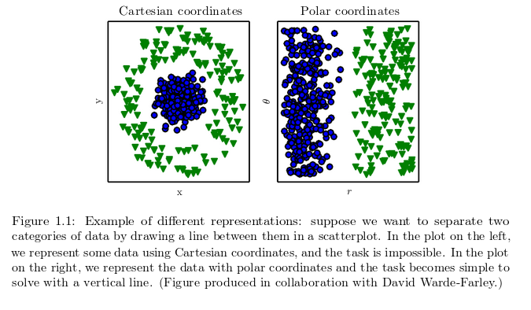
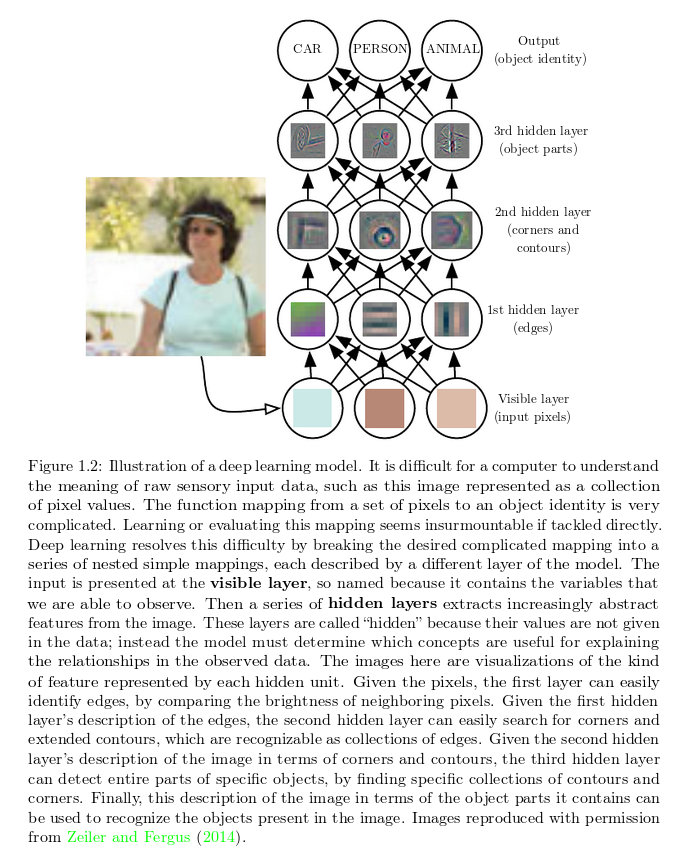
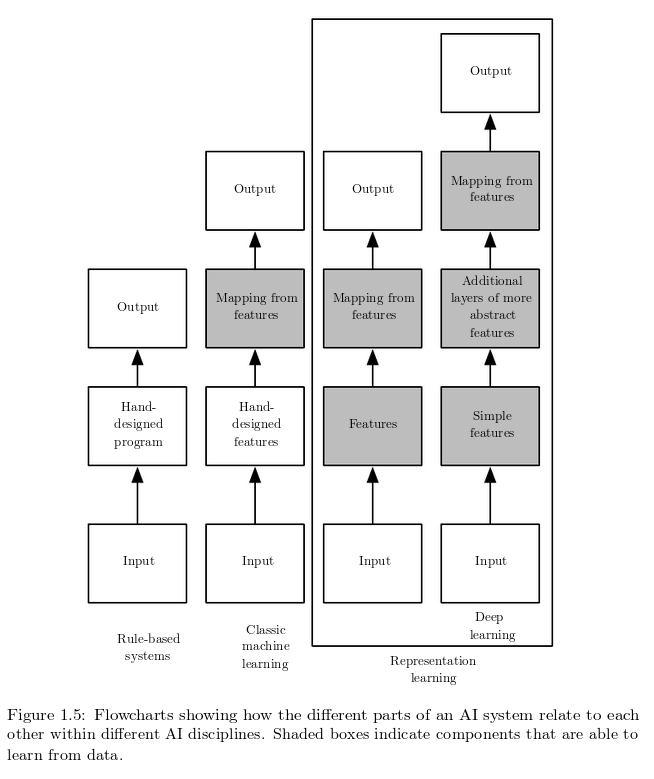

### SOURCE
[deeplearningbook](http://www.deeplearningbook.org/) 

# INTRODUCTION

The true challenge to artificial intelligence proved to be solving
the tasks that are easy for people to perform but hard for people to describe formally—problems that we solve intuitively, that feel automatic, like recognizing spoken words or faces in images.

The solution is to allow computers to learn from experience and understand the world in terms of a hierarchy of concepts, with each concept defined through its relation to simpler concepts. The hierarchy of concepts enables the computer to learn complicated concepts by building them out of simpler ones. If we draw a graph showing how these concepts are built on top of each other, the graph is deep, with many layers. For this reason, we call this approach to AI **deep learning**.

Several artificial intelligence projects have sought to hard-code knowledge about the world in formal languages.This is known as the knowledge base approach to artificial intelligence.

The difficulties faced by systems relying on hard-coded knowledge suggestthat AI systems need the ability to acquire their own knowledge, **by extracting patterns from raw data**. This capability is known as **machine learning**.

The performance of simple machine learning algorithms (like logistic regression algorithms) depends on the **representation** of the data. Each piece of information that is used to describe the agent, environment etc. is called a **feature**. The algorithm then learns how each of these features affect the various outcomes. A drawback with this approach is that it cannot influence how these features are defined. If the data set were to be altered (eg. if instead of a doctor's report it was given an MRI scan of the patient, the logistic regression algorithm wouldn't be able to make predictions). The representation of data has a huge impact on the performance of the algorithm as shown by the image below.

The difficulty to accurately define the right features depends on the task. For eg. in speaker recognition, the size of the vocal tract is a good feature to identify if the speaker is a man, woman or a child. But it is difficult to define a feautre when the task is to identify a car from a picture. We could describe wheels as a feature since cars have wheels, but the algorithm might confuse some other part of the image for a wheel (maybe due to its geometry) or might fail to identify the car altogether.

One solution to this problem is to use machine learning to discover not only the mapping from representation to output but also the representation itself. This approach is known as **representation learning**. Learned representations drastically improve the performance and allow the AI to adapt to new tasks with minimal human intervention.
 
When designing algorithms for learning features, we need to separate the **factors of variation**. Factors refer to different sources of influence (often not directly observable). eg. In the car problem, factors of influence include the color and position of the car, its angle to the camera and brightness of the sun. The effect of such factors can be quite big. The color of a red car may appear black at night.

It is difficult to extract such high level abstract features from raw data. **Deep learning** solves this central problem in representation learning by introducing representations that are expressed in terms of other, simpler representations. 

Deep learning enables the computer to build complex concepts out of simpler concepts. Figure 1.2 shows how a deep learning system can represent the concept of an image of a person by combining simpler concepts, such as corners and contours, which are in turn defined in terms of edges.

 

# PART 1

## LINEAR ALGEBRA

